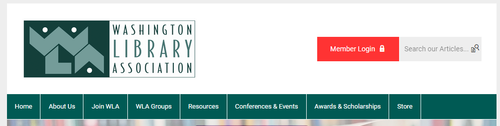

# SCLA Website Notes

## [Home Page Main](https://www.scla.org/)

### Colors/Theme
Something I think would look good is to darken the menu bar, the white text and light blue are hard to read. Also, if we can stop the menu bar from going all the way across the screen, the site might look a little more modern.

Above is SCLA's website showing the color issues, below is the WLA's website, which looks much cleaner.

---

Another thing that sticks out is the strange coloring on the first block of text. The blue text doesn't match the rest of the site and the fonts/colors in the *"ACT NOW TO STAY INFORMED"* image are mismatched from our theme.

I also think it would look good to change the *">> Click here to Sign up for Library Advocacy Alerts <<"* button would look better as an actual button instead of the link.

---

The theming looks good for the rest of **Home Page Main** but I'd like to change the bulletpoint quote from the *SCLA Statement on Censorship* to a dash.

### My Suggestions

#### Wishes

#### Realistic

## Organization